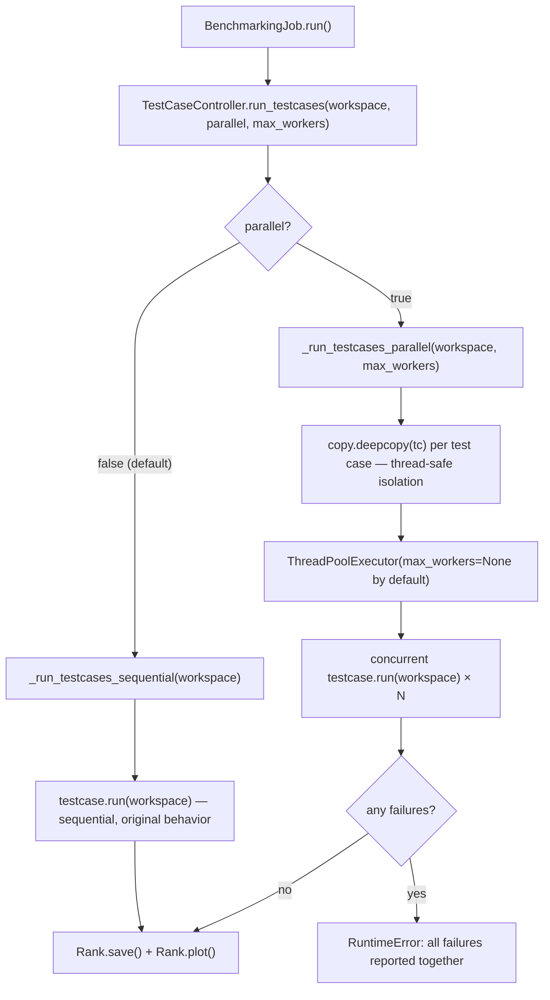

# Parallel Test Case Execution

## Table of Contents
- [Motivation](#motivation)
  - [Background](#background)
  - [Goals](#goals)
- [Proposal](#proposal)
- [Details](#details)
  - [Phase 1: ThreadPoolExecutor-Based Parallelism](#phase-1-threadpoolexecutor-based-parallelism)
    - [Design](#design)
    - [GIL Limitations and Workload Guidance](#gil-limitations-and-workload-guidance)
    - [Thread Safety: Deep Copy Isolation](#thread-safety-deep-copy-isolation)
    - [Race Condition Fix in `_get_output_dir()`](#race-condition-fix-in-_get_output_dir)
    - [Configuration](#configuration)
    - [Files Changed](#files-changed)
  - [Phase 2: Sandbox Engine (Future, PR #526)](#phase-2-sandbox-engine-future-pr-526)
  - [Comparison of Approaches](#comparison-of-approaches)
- [Roadmap](#roadmap)

---

## Motivation

### Background

Ianvs supports testing multiple groups of hyperparameters across
algorithm modules. Each test case runs a full training or inference
pipeline, which can take minutes to hours depending on the model
and dataset. When a user wants to compare several parameter
combinations (e.g., different learning rates, batch sizes, or
model architectures), these test cases execute sequentially in
`TestCaseController.run_testcases()`.

This serial execution causes unbearable time overhead as documented
in [Issue #8](https://github.com/kubeedge/ianvs/issues/8). For
example, testing 5 hyperparameter groups on a model that takes
30 minutes each requires 2.5 hours total — even if the machine
has sufficient resources to run multiple test cases simultaneously.

The core sequential loop in `testcasecontroller.py`:

```python
for testcase in self.test_cases:
    res, time = (testcase.run(workspace), utils.get_local_time())
    succeed_results[testcase.id] = (res, time)
```

has no parallelism mechanism and no configuration option for
concurrent execution.

### Goals

1. Enable opt-in parallel execution of test cases to reduce
   total benchmarking time for workloads that benefit from
   concurrency (see [GIL Limitations](#gil-limitations-and-workload-guidance)).

2. Maintain full backward compatibility — all existing
   `benchmarkingjob.yaml` files continue to work without
   modification.

3. Fix an existing race condition in `_get_output_dir()`
   that would cause failures under any concurrent execution.

4. Provide a dependency-free solution that works on all
   platforms (Linux, macOS, Windows).

5. Establish a clear migration path to the Sandbox Engine
   (PR [#526](https://github.com/kubeedge/ianvs/pull/526))
   for full process isolation and dependency management.

---

## Proposal

A **phased approach** to parallel test case execution:

**Phase 1 (This PR):** Opt-in thread-based parallelism using
Python's `concurrent.futures.ThreadPoolExecutor`. No new
dependencies, works on all platforms, and immediately addresses
the time overhead problem for I/O-bound and GPU-offloaded
workloads.

**Phase 2 (Future):** The Sandbox Engine (PR #526) for full
process isolation, dependency conflict resolution, and OS-level
resource limits. Phase 1 is a pragmatic bridge that delivers
immediate value while Phase 2 is developed.

The `parallel` flag defaults to `false` — zero impact on existing
users until they explicitly opt in.

---

## Details

### Phase 1: ThreadPoolExecutor-Based Parallelism

#### Design

`ThreadPoolExecutor` is chosen over `ProcessPoolExecutor` for a
critical reason: ML model objects (PyTorch modules, TensorFlow
graphs, Sedna paradigm instances) loaded during `testcase.run()`
are often not picklable — a hard requirement for process-based
parallelism. Thread-based parallelism shares the same memory
space, eliminating serialization entirely.

The implementation adds two private methods to `TestCaseController`:

- `_run_testcases_sequential()` — preserves the exact original
  behavior, called when `parallel=False` (default)
- `_run_testcases_parallel()` — runs test cases concurrently
  using `ThreadPoolExecutor`, called when `parallel=True`

The public `run_testcases()` method routes to the appropriate
implementation:

```python
def run_testcases(self, workspace, parallel=False, max_workers=None):
    if isinstance(parallel, str):
        parallel = parallel.lower() in ("true", "1", "yes")
    if parallel:
        return self._run_testcases_parallel(workspace, max_workers)
    return self._run_testcases_sequential(workspace)
```

Failed test cases in parallel mode are collected and reported
together rather than stopping at the first failure, giving users
a complete picture of which parameter groups failed.

#### GIL Limitations and Workload Guidance

Python's Global Interpreter Lock (GIL) limits true CPU parallelism
for pure Python threads. Users should understand which workloads
benefit from Phase 1 and which do not:

**Phase 1 provides meaningful speedup for:**
- **GPU-offloaded inference and training**: PyTorch and TensorFlow
  release the GIL during CUDA kernel execution, so multiple
  threads can drive separate GPU streams concurrently.
- **I/O-bound pipelines**: dataset loading, preprocessing from
  disk, and result writing all release the GIL, enabling real
  overlap between threads.
- **Hyperparameter search across multiple test cases**: when each
  test case independently loads data and runs inference, I/O
  overlap alone reduces wall-clock time significantly.

**Phase 1 provides limited speedup for:**
- **Pure CPU-bound training**: if the bottleneck is Python-level
  computation that holds the GIL throughout, threads will not
  achieve true parallelism. For these workloads, Phase 2 (Sandbox
  Engine with process isolation) will provide better results.

This limitation is intentional and documented — Phase 1 is
designed for the common case of I/O-bound hyperparameter search
in the same environment. Phase 2 addresses the harder problem.

#### Thread Safety: Deep Copy Isolation

The original `TestCase` instances share a single `test_env`
object (including `dataset`). Concurrent mutation of shared state
— for example, `paradigm.run()` writing to `test_env` attributes
or `dataset.load_data()` modifying shared structures — would cause
race conditions under parallel execution.

Phase 1 eliminates this by deep copying each test case before
submitting to the thread pool:

```python
parallel_testcases = [copy.deepcopy(tc) for tc in self.test_cases]
```

Each thread receives its own independent copy of `test_env` and
`dataset`, with no shared mutable state. The original
`self.test_cases` list is never modified.

`max_workers` deliberately defaults to `None`, which causes
`ThreadPoolExecutor` to use its own safe default
(`min(32, os.cpu_count() + 4)`). This avoids the OOM risk of
spawning one thread per test case when a user has many parameter
groups and resource-intensive models.

#### Race Condition Fix in `_get_output_dir()`

The original implementation contains a race condition:

```python
# ORIGINAL — race condition under concurrency
while flag:
    output_dir = os.path.join(workspace, self.algorithm.name, str(self.id))
    if not os.path.exists(output_dir):  # two threads pass simultaneously
        flag = False
```

Two threads executing simultaneously can both pass the
`os.path.exists()` check before either creates the directory,
resulting in a collision. The fix uses `uuid1()` (already unique
per test case) combined with `os.makedirs(exist_ok=True)`:

```python
# FIXED — atomic, no race condition
def _get_output_dir(self, workspace):
    output_dir = os.path.join(workspace, self.algorithm.name, str(self.id))
    os.makedirs(output_dir, exist_ok=True)
    return output_dir
```

This fix also benefits sequential execution by removing an
unnecessary while loop.

#### Configuration

Users opt in by adding two optional fields to
`benchmarkingjob.yaml`:

```yaml
benchmarkingjob:
  name: "benchmarkingjob"
  workspace: "./workspace"
  parallel: true      # optional, default: false
  max_workers: 4      # optional, default: None (ThreadPoolExecutor safe default)
  testenv: "..."
  test_object: ...
```

Both fields are optional. When `parallel` is omitted or `false`,
execution is identical to the current behavior. YAML string values
(`"true"`, `"false"`, `"yes"`, `"1"`) are coerced correctly.

#### Files Changed

| File | Change |
|---|---|
| `core/testcasecontroller/testcasecontroller.py` | Add `_run_testcases_sequential()`, `_run_testcases_parallel()`; update `run_testcases()` signature with YAML coercion and validation |
| `core/testcasecontroller/testcase/testcase.py` | Fix race condition in `_get_output_dir()` |
| `core/cmd/obj/benchmarkingjob.py` | Add `parallel: bool` and `max_workers: Optional[int]` fields; pass to `run_testcases()` |
| `core/testcasecontroller/tests/test_parallel_execution.py` | 20 unit tests covering correctness, isolation, coercion, validation, and concurrency |

### Phase 2: Sandbox Engine (Future, PR #526)

PR [#526](https://github.com/kubeedge/ianvs/pull/526) — now
merged into `main` as a formal architectural proposal — describes
a comprehensive Sandbox Engine that addresses problems beyond
basic parallelism:

- **Dependency isolation**: each test case runs in its own
  virtual environment, preventing conflicts between algorithms
  requiring different package versions
- **OOM protection**: OS-level resource limits via `prlimit`
  and `cgroups` (Linux) prevent a single test case from
  crashing the entire benchmarking job
- **Full process isolation**: `ProcessPoolExecutor` or subprocess
  execution becomes viable once the Sandbox Engine handles
  serialization across process boundaries

Phase 1 (this PR) and Phase 2 (Sandbox Engine) are complementary,
not competing. They operate at different layers:

- Phase 1 solves **time overhead** for the common case: same
  environment, multiple hyperparameter groups, I/O-bound or
  GPU-offloaded workloads. No new dependencies. Works today.
- Phase 2 solves **isolation and resource safety** for the harder
  case: conflicting dependencies, OOM risk, production edge
  deployments. Requires Linux and new dependencies (`uv`, `psutil`).

Phase 1 does not block Phase 2. The `run_testcases()` entry point
identified in the Sandbox Engine proposal (`testcasecontroller.py`
line 46) is additive — the Sandbox Engine can replace or wrap
`_run_testcases_parallel()` in Phase 2 without changing the
public API of `run_testcases()`.

### Comparison of Approaches

| Aspect | Phase 1 (This PR) | Phase 2 (Sandbox Engine, PR #526) |
|---|---|---|
| Status | Ready to merge | Architectural proposal merged; implementation pending |
| Platform | Linux, macOS, Windows | Linux primary |
| New dependencies | None | `uv`, `psutil` |
| Execution model | Threads (ThreadPoolExecutor) | Processes / containers |
| GIL limitation | Yes — limited for pure CPU workloads | No — separate processes |
| Dependency isolation | No | Yes (separate venv per test case) |
| OOM protection | No (safe default workers) | Yes (prlimit/cgroups) |
| Backward compatibility | Full (`parallel: false` default) | New config schema |
| Best for | I/O-bound, GPU-offloaded, same environment | Conflicting deps, resource isolation |

---

## Roadmap

### Phase 1 (This PR)
- [x] Fix race condition in `_get_output_dir()`
- [x] Add `ThreadPoolExecutor`-based parallel execution
- [x] Deep copy isolation for thread safety
- [x] `parallel` and `max_workers` config fields with YAML coercion
- [x] `max_workers` defaults to `None` (safe ThreadPoolExecutor default)
- [x] Full backward compatibility verified
- [x] 20 unit tests covering correctness, isolation, and edge cases

### Phase 2 (Future — Sandbox Engine Implementation)
- [ ] Implement Sandbox Engine per PR #526 architectural proposal
- [ ] Full process isolation with `uv`/`venv`
- [ ] OS-level resource limits (Linux: `prlimit`, `cgroups`)
- [ ] Cross-platform graceful degradation
- [ ] Migration guide from Phase 1 threading to Phase 2 process isolation

---

## Execution Flow



---

## Paradigm Compatibility Notes

The Sandbox Engine proposal (PR #526, §9.2) provides per-paradigm parallel
processing research notes. This section maps those findings to Phase 1
(ThreadPoolExecutor) to clarify which paradigms benefit immediately.

| Paradigm | Phase 1 benefit | Reason |
|---|---|---|
| Single-task learning | ✅ High | Fully independent test cases — embarrassingly parallel. I/O and GPU compute dominate; GIL released during both. |
| Joint inference | ✅ High | Cloud-edge split inference; data loading and GPU inference both release the GIL. |
| Federated learning | ✅ Moderate | Local training phases across different federated configurations are parallel-safe. Global aggregation within one test case remains sequential. |
| Lifelong learning | ⚠️ Low | Knowledge base is a filesystem artifact (workspace directory) — sandbox boundary preserves it. But sequential knowledge accumulation contract limits safe parallelism across tasks. |
| Incremental learning | ❌ Not recommended | Trains one global model sequentially across rounds by design. As noted in PR #526 §9.2 and the PR #308 review, parallelising incremental learning requires gradient synchronization research that is out of scope for Phase 1 and Phase 2. Use sequential mode. |

Phase 1 is most beneficial for single-task and joint inference paradigms.
Incremental learning users should leave `parallel: false` (the default).
Phase 2 (Sandbox Engine implementation) will provide process-level isolation
that enables safer parallelism for the remaining paradigms.
